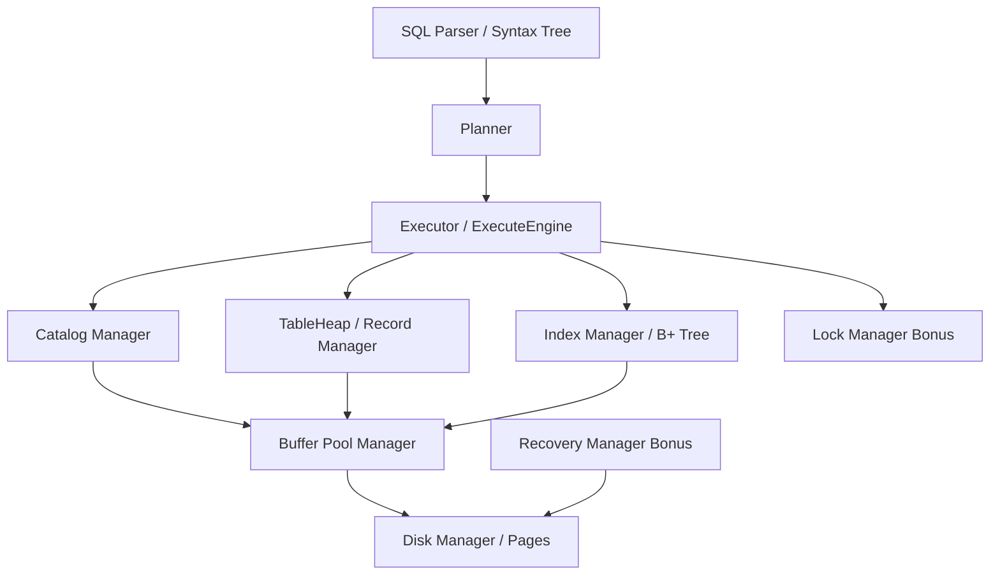

# MiniSQL 课程设计详细设计文档

## 1. 项目概述

本项目基于课程提供的 MiniSQL C++ 框架完成数据库内核主要模块实现。系统目标是支持一个轻量级关系数据库，从磁盘页管理、缓冲池、记录存储、B+ 树索引、Catalog 元数据、SQL 执行到并发控制与恢复 bonus 均形成可独立测试的模块。

项目采用 CMake 构建，核心代码位于 `src/`，单元测试位于 `test/`。整体架构按层次划分如下：



设计原则：

- 模块间通过清晰接口协作，例如 Executor 通过 Catalog 查询表和索引，通过 TableHeap 访问记录，通过 IndexInfo 更新索引。
- 存储、缓冲、记录、索引、Catalog、Executor、并发和恢复均可用对应单元测试单独验证。
- SQL 命令层在 `ExecuteEngine` 中集中分发，DML 语句交给 Planner 和 Executor，DDL/数据库管理命令直接调用 Catalog 和 DBStorageEngine。
- Bonus 模块保持与主流程相对独立：LockManager 通过 Txn/TxnManager 测试并发控制语义；RecoveryManager 使用测试内存 KV 数据库验证日志链、checkpoint、redo 和 undo。

## 2. 存储管理设计

### 2.1 主要文件

- `src/storage/disk_manager.cpp`
- `src/include/storage/disk_manager.h`
- `src/page/bitmap_page.cpp`
- `src/include/page/bitmap_page.h`
- `src/include/page/disk_file_meta_page.h`
- `src/include/page/page.h`

### 2.2 页组织

磁盘文件以固定大小页为单位，页大小由 `PAGE_SIZE` 定义。逻辑页号和物理页号之间通过元数据页与 bitmap 页组织：

- 第 0 页是磁盘文件元数据页，记录已分配页数量、已扩展页数量以及每个 bitmap 区间的已分配页数。
- bitmap 页记录某一连续数据页区间内每个逻辑页是否被占用。
- 数据页保存表页、索引页、Catalog 元数据页等上层内容。

逻辑页分配过程：

1. `DiskManager::AllocatePage()` 扫描已有 bitmap 页，寻找仍有空位的区间。
2. 调用 `BitmapPage::AllocatePage()` 设置空闲 bit，得到区间内偏移。
3. 由 bitmap 页编号和页内偏移计算逻辑页号。
4. 更新磁盘元数据并写回对应 bitmap 页。

逻辑页释放过程：

1. `DiskManager::DeAllocatePage()` 根据逻辑页号定位 bitmap 页和页内偏移。
2. 调用 `BitmapPage::DeAllocatePage()` 清除 bit。
3. 更新元数据中的分配计数。

### 2.3 读写接口

DiskManager 对上层暴露：

- `ReadPage(page_id_t logical_page_id, char *page_data)`
- `WritePage(page_id_t logical_page_id, const char *page_data)`
- `AllocatePage()`
- `DeAllocatePage(page_id_t logical_page_id)`
- `IsPageFree(page_id_t logical_page_id)`

上层模块只感知逻辑页号，不直接操作文件偏移。这样 BufferPool、TableHeap、B+ Tree 可以共用统一页接口。

### 2.4 测试

独立测试：

- `disk_manager_test`

测试覆盖 bitmap 分配/释放、空闲页复用和大量页分配。

## 3. 缓冲池管理设计

### 3.1 主要文件

- `src/buffer/buffer_pool_manager.cpp`
- `src/include/buffer/buffer_pool_manager.h`
- `src/buffer/lru_replacer.cpp`
- `src/include/buffer/lru_replacer.h`

### 3.2 BufferPoolManager

BufferPoolManager 维护固定数量的内存帧，每个帧对应一个 `Page` 对象。核心数据结构：

- `pages_`：页帧数组。
- `page_table_`：逻辑页号到 frame id 的映射。
- `free_list_`：尚未使用的空闲 frame。
- `replacer_`：LRU 替换器，选择 pin count 为 0 的可淘汰页。

主要流程：

- `FetchPage(page_id)`：若页已在缓冲池中，则增加 pin count 并返回；否则从 free list 或 LRU victim 取 frame，必要时刷脏页，再从磁盘读入目标页。
- `NewPage(page_id)`：从 DiskManager 分配新逻辑页，再取 frame 初始化页内容。
- `UnpinPage(page_id, is_dirty)`：减少 pin count，并在 pin count 归零后交给 replacer 管理。
- `FlushPage(page_id)`：将缓冲页写回磁盘。

### 3.3 LRUReplacer

LRUReplacer 使用双向链表和哈希表维护可替换 frame：

- `Unpin(frame_id)`：frame 进入 LRU 队列。
- `Pin(frame_id)`：frame 被使用，从 LRU 队列移除。
- `Victim(frame_id*)`：淘汰最久未使用的 frame。

### 3.4 测试

独立测试：

- `lru_replacer_test`
- `buffer_pool_manager_test`

测试覆盖 LRU victim 顺序、pin/unpin 行为、二进制页数据读写和脏页刷盘。

## 4. 记录管理设计

### 4.1 主要文件

- `src/record/column.cpp`
- `src/record/row.cpp`
- `src/record/schema.cpp`
- `src/record/types.cpp`
- `src/page/table_page.cpp`
- `src/storage/table_heap.cpp`
- `src/storage/table_iterator.cpp`

### 4.2 数据模型

记录层包含以下对象：

- `Field`：单个字段值，支持 `int`、`float`、`char` 等类型和空值标记。
- `Column`：列元数据，包括列名、类型、长度、列序号、是否唯一等。
- `Schema`：表结构，由多个 Column 组成。
- `Row`：一行记录，包含 Field 列表和 RowId。
- `RowId`：由 page id 和 slot num 组成，唯一定位表中记录。

`Field`、`Column`、`Schema`、`Row` 都实现序列化和反序列化，使记录与元数据可以持久化到页中。

### 4.3 TablePage

TablePage 是记录在页内的实际载体。页内维护：

- prev page id 和 next page id，用于表页双向链表。
- tuple count、deleted count 等页头信息。
- slot array，记录每个 tuple 的 offset、size 和删除标记。
- tuple data，从页尾向前存放。

插入记录时先计算序列化大小，再在页内寻找空间。删除采用标记删除和物理删除配合的方式，支持后续回收 slot。

### 4.4 TableHeap 与迭代器

TableHeap 管理一张表的多个 TablePage：

- `InsertTuple()` 从首页开始寻找可插入页，空间不足时申请新页并挂到链表尾部。
- `GetTuple()` 按 RowId 定位页和 slot，反序列化得到 Row。
- `MarkDelete()`、`ApplyDelete()`、`RollbackDelete()` 支持删除流程。
- `UpdateTuple()` 在页内更新记录，空间不足时返回失败。
- `TableIterator` 跨页遍历有效记录，供 SeqScanExecutor 和测试使用。

### 4.5 测试

独立测试：

- `tuple_test`
- `table_heap_test`

测试覆盖 Field/Row 序列化、表插入、读取、删除、更新和迭代。

## 5. 索引管理设计

### 5.1 主要文件

- `src/index/b_plus_tree.cpp`
- `src/index/b_plus_tree_index.cpp`
- `src/index/index_iterator.cpp`
- `src/page/b_plus_tree_page.cpp`
- `src/page/b_plus_tree_leaf_page.cpp`
- `src/page/b_plus_tree_internal_page.cpp`

### 5.2 GenericKey

索引键统一封装为 `GenericKey`，由 `GenericComparator` 根据索引 key schema 比较。这样 B+ 树不需要关心具体列类型，只处理二进制 key 与 RowId。

### 5.3 B+ 树页结构

B+ 树页分为：

- `BPlusTreePage`：公共页头，保存 page type、size、max size、parent page id、page id。
- `BPlusTreeLeafPage`：保存 key 到 RowId 的映射，并通过 next page id 串联叶子页。
- `BPlusTreeInternalPage`：保存 key 到 child page id 的映射，内部页第一个 key 作为占位。

### 5.4 插入流程

插入分为以下步骤：

1. 若树为空，`StartNewTree()` 创建根叶子页。
2. `FindLeafPage()` 从根向下定位目标叶子页。
3. `InsertIntoLeaf()` 在叶子页内按 key 顺序插入，重复 key 返回失败。
4. 若叶子页溢出，`Split(LeafPage*)` 分裂叶子页，并把新页首 key 插入父节点。
5. 父节点溢出时继续分裂内部页，必要时创建新根。

### 5.5 查询与迭代

- `GetValue()` 定位叶子页并查找 key，返回匹配 RowId。
- `Begin()` 返回最左叶子页第一个元素。
- `Begin(key)` 返回第一个大于等于 key 的迭代器。
- `End()` 表示遍历结束。
- `IndexIterator` 在叶子页内移动，页内到尾后跳转到 next leaf。

### 5.6 删除策略与边界

`Remove()` 支持从叶子页中删除 key，并处理根叶子页为空的情况。当前实现通过公共测试验证，但没有完整实现 B+ 树删除后的内部节点合并和重分配。因此：

- 普通索引删除、公共测试和 Executor 的索引维护可以正常工作。
- 对大量删除导致严重低水位的复杂场景，当前实现不保证完整 B+ 树重平衡。

该限制已在 README 和测试说明中列出，避免验收时夸大实现范围。

### 5.7 测试

独立测试：

- `b_plus_tree_test`
- `index_iterator_test`
- `b_plus_tree_index_test`

测试覆盖插入、查询、叶子分裂、迭代器范围扫描和 Index 封装。

## 6. Catalog 管理设计

### 6.1 主要文件

- `src/catalog/catalog.cpp`
- `src/catalog/table.cpp`
- `src/catalog/indexes.cpp`
- `src/include/catalog/catalog.h`
- `src/include/catalog/table.h`
- `src/include/catalog/indexes.h`

### 6.2 元数据结构

Catalog 负责维护数据库中表和索引的元数据：

- `CatalogMeta`：记录 table id 到 table meta page id、index id 到 index meta page id 的映射。
- `TableMetadata`：保存 table id、table name、first page id 和 schema。
- `IndexMetadata`：保存 index id、index name、table id、key map。
- `TableInfo` 和 `IndexInfo`：运行期对象，封装 metadata 和实际 TableHeap/Index 实例。

Catalog 元数据写入固定逻辑页，表和索引元数据各自占用独立页。数据库重启时通过 `CatalogManager(init=false)` 从磁盘恢复所有表和索引。

### 6.3 表管理

`CreateTable()` 流程：

1. 检查表名是否重复。
2. 为表数据分配首页。
3. 创建 `TableHeap`。
4. 为表元数据分配页并序列化 `TableMetadata`。
5. 更新 CatalogMeta 并刷回。

`DropTable()` 删除表时同步删除该表关联的所有索引，再释放表元数据和表数据页。

### 6.4 索引管理

`CreateIndex()` 流程：

1. 检查表是否存在以及索引名是否重复。
2. 根据列名生成 key map 和 index key schema。
3. 创建 B+TreeIndex。
4. 扫描已有表数据，把现有记录插入索引。
5. 序列化 IndexMetadata 并更新 CatalogMeta。

`DropIndex()` 删除索引元数据和运行期对象，并更新 CatalogMeta。

### 6.5 测试

独立测试：

- `catalog_test`

测试覆盖 CatalogMeta、表创建/加载/删除、索引创建/加载/删除。

## 7. SQL 执行设计

### 7.1 主要文件

- `src/executor/execute_engine.cpp`
- `src/planner/planner.cpp`
- `src/executor/*_executor.cpp`
- `src/include/executor/plans/*.h`
- `src/include/planner/statement/*.h`
- `src/include/planner/expressions/*.h`

### 7.2 ExecuteEngine 命令分发

Parser 生成语法树后，`ExecuteEngine::Execute()` 按 AST 节点类型分发：

- 数据库命令：`create database`、`drop database`、`show databases`、`use`
- 表命令：`show tables`、`create table`、`drop table`
- 索引命令：`show indexes`、`create index`、`drop index`
- 数据命令：`select`、`insert`、`delete`、`update`
- 文件和会话命令：`execfile`、`quit`
- 事务命令：`begin`、`commit`、`rollback`

启动时 `ExecuteEngine` 扫描 `./databases`，只加载包含合法 Catalog magic 的数据库文件，避免测试运行生成的无关 `.db` 文件被误认为数据库。

### 7.3 DDL 实现

`create table` 解析列定义、主键列表和 unique 标记：

- 支持 `int`、`float`、`char(n)`。
- 主键列和 unique 列标记为唯一。
- 对主键/唯一列自动创建 B+ 树索引，命名为 `__auto_<table>_<column>`。

`create index` 支持指定索引名、表名和列列表，默认创建 B+ 树索引。`show indexes` 输出当前数据库所有表的索引名、表名和索引列。

### 7.4 DML 执行

DML 语句先由 Planner 生成 Plan，再由 Executor 执行：

- `SeqScanExecutor`：顺序扫描 TableHeap，按 predicate 过滤，并按输出 schema 投影。
- `IndexScanExecutor`：在可用索引上进行扫描，再回表读取 Row。
- `ValuesExecutor`：为 raw insert 生成 Row。
- `InsertExecutor`：插入 TableHeap，并更新表上所有索引。
- `DeleteExecutor`：标记删除记录，并从所有索引删除对应 key。
- `UpdateExecutor`：更新 TableHeap，并维护旧 key 删除、新 key 插入。

Planner 会尝试根据查询条件选择可用索引；没有合适索引时退化为顺序扫描。

### 7.5 事务命令当前范围

SQL 层的 `begin`、`commit`、`rollback` 已被接收并返回执行结果，用于保持命令完整性。当前主 SQL 执行链路尚未把 LockManager/RecoveryManager 深度接入每条 DML，因此事务命令在 SQL shell 中是轻量占位语义。并发控制和恢复作为 bonus 模块通过独立测试验证。

### 7.6 测试

独立测试：

- `executor_test`

手工 SQL 冒烟测试示例：

```sql
create database codex_sql_test;
use codex_sql_test;
create table student (id int unique, name char(12), score float, primary key(id));
show tables;
show indexes;
insert into student values(1, "alice", 95.5);
select id,name from student where id = 1;
create index idx_name on student(name);
show indexes;
drop index idx_name;
drop table student;
drop database codex_sql_test;
quit;
```

## 8. Bonus：并发控制设计

### 8.1 主要文件

- `src/concurrency/lock_manager.cpp`
- `src/include/concurrency/lock_manager.h`
- `src/concurrency/txn_manager.cpp`
- `src/include/concurrency/txn.h`
- `src/include/concurrency/txn_manager.h`

### 8.2 锁类型与事务状态

LockManager 支持记录级锁：

- 共享锁 `S`
- 排他锁 `X`
- 锁升级 `S -> X`

事务状态采用两阶段锁协议：

- `GROWING`：允许加锁。
- `SHRINKING`：释放锁后进入该状态，不允许再加新锁。
- `COMMITTED`
- `ABORTED`

在 `READ_UNCOMMITTED` 隔离级别申请共享锁会被中止，原因是该隔离级别不应读锁。

### 8.3 锁请求队列

每个 RowId 对应一个 `LockRequestQueue`：

- `req_list_` 保存该 RID 上所有事务请求。
- `req_list_iter_map_` 用于按 txn id 快速定位请求。
- `sharing_cnt_` 记录已授予共享锁数量。
- `is_writing_` 表示是否存在已授予排他锁。
- `is_upgrading_` 防止多个事务同时升级。
- `cv_` 用于阻塞和唤醒等待事务。

加锁流程：

1. 检查事务状态和隔离级别。
2. 将请求加入对应 RID 队列。
3. 若当前锁兼容则授予锁并加入事务 lock set。
4. 否则通过 condition variable 等待。
5. 等待过程中若事务被死锁检测标记为 aborted，则清理请求并抛出 `TxnAbortException`。

### 8.4 锁升级

升级流程：

1. 要求事务已经持有该 RID 的共享锁。
2. 若其他事务正在升级，则当前事务以 `kUpgradeConflict` 中止。
3. 将自身请求从 shared 改为 exclusive，并等待其他共享锁释放。
4. 当该 RID 上只剩自身一个共享锁时，切换为排他锁。

### 8.5 死锁检测

LockManager 周期性构造 wait-for graph：

- 对每个等待请求，向阻塞它的已授予锁事务添加边。
- 使用 DFS 检测环。
- 发现环后选择环内事务 id 最大者作为 victim。
- 将 victim 状态置为 `ABORTED`，删除图中相关边并唤醒所有锁队列。

### 8.6 测试

独立测试：

- `lock_manager_test`

测试覆盖：

- Read Uncommitted 下共享锁中止。
- 两阶段锁 shrinking 状态限制。
- 锁升级成功、升级冲突、升级后 abort。
- waits-for graph 加边、删边、环检测。
- 后台死锁检测和 victim 唤醒。

## 9. Bonus：恢复管理设计

### 9.1 主要文件

- `src/include/recovery/log_rec.h`
- `src/include/recovery/recovery_manager.h`
- `src/include/recovery/log_manager.h`

### 9.2 日志记录

测试用日志类型包括：

- `Begin`
- `Insert`
- `Delete`
- `Update`
- `Commit`
- `Abort`

每条日志保存：

- `lsn_`
- `prev_lsn_`
- `txn_id_`
- 修改前 key/value
- 修改后 key/value

`LogRec::prev_lsn_map_` 维护每个事务最后一条日志的 LSN，创建新日志时自动填充 `prev_lsn_`，形成事务日志链。

### 9.3 Checkpoint

`CheckPoint` 保存：

- `checkpoint_lsn_`
- checkpoint 时仍活跃的事务表 ATT
- checkpoint 时已持久化的数据快照

`RecoveryManager::Init()` 从 checkpoint 恢复 `persist_lsn_`、`active_txns_` 和内存数据库内容。

### 9.4 Redo 阶段

Redo 从 checkpoint 之后按 LSN 顺序处理日志：

- `Insert`：写入新 key/value。
- `Delete`：删除旧 key。
- `Update`：写入新 key/value。
- `Commit`：从活跃事务表移除。
- `Abort`：沿该事务 `prev_lsn_` 链执行 undo，并从活跃事务表移除。

该设计匹配课程测试的简化恢复语义：显式 abort 事务在 redo 阶段结束后已经回滚。

### 9.5 Undo 阶段

Undo 针对 redo 后仍在 `active_txns_` 中的未完成事务：

- 插入日志反向操作为删除新 key。
- 删除日志反向操作为恢复旧 key/value。
- 更新日志反向操作为恢复旧 key/value，并在 key 改变时删除新 key。

完成后清空活跃事务表。

### 9.6 测试

独立测试：

- `recovery_manager_test`

测试覆盖日志链 prev_lsn、checkpoint 初始化、redo 结果和 undo 结果。

## 10. 测试方案

### 10.1 单模块测试

本项目按模块保留独立测试目标：

```powershell
.\build-native\test\disk_manager_test.exe
.\build-native\test\lru_replacer_test.exe
.\build-native\test\buffer_pool_manager_test.exe
.\build-native\test\tuple_test.exe
.\build-native\test\table_heap_test.exe
.\build-native\test\b_plus_tree_test.exe
.\build-native\test\index_iterator_test.exe
.\build-native\test\b_plus_tree_index_test.exe
.\build-native\test\catalog_test.exe
.\build-native\test\executor_test.exe
.\build-native\test\lock_manager_test.exe
.\build-native\test\recovery_manager_test.exe
```

各模块可独立验证，也可与前置模块联合验证。例如 Catalog 依赖 BufferPool 和 DiskManager，Executor 依赖 Catalog、TableHeap 和 Index。

### 10.2 顺序回归命令

Windows PowerShell 下需要先加入 DLL 路径：

```powershell
$env:PATH="C:\Users\Lenovo\Documents\New project\minisql-course-design\build-native\bin;C:\Users\Lenovo\Documents\New project\minisql-course-design\build-native\glog-build;C:\Users\Lenovo\Documents\New project\minisql-course-design\build-native\googletest-build;$env:PATH"
```

再顺序执行测试。注意不要并行运行共享 `databases/*.db` 的测试，Windows 下可能因为同名数据库文件或文件占用产生误报。

### 10.3 已通过测试记录

最近一次顺序回归已通过：

- `disk_manager_test`：2 tests passed
- `lru_replacer_test`：1 test passed
- `buffer_pool_manager_test`：1 test passed
- `tuple_test`：2 tests passed
- `table_heap_test`：1 test passed
- `b_plus_tree_test`：1 test passed
- `index_iterator_test`：1 test passed
- `b_plus_tree_index_test`：2 tests passed
- `catalog_test`：3 tests passed
- `executor_test`：4 tests passed
- `lock_manager_test`：10 tests passed
- `recovery_manager_test`：1 test passed

## 11. Git 开发时间线

项目按模块提交，便于验收时以 Git log 说明开发过程：

| 提交 | 说明 |
| --- | --- |
| `880d62e` | 导入 MiniSQL 课程框架 |
| `951097a` | 支持 Windows MinGW 构建 |
| `4c4f07d` | 实现 DiskManager、BitmapPage、LRU 和 BufferPoolManager |
| `6defc20` | 实现记录层、TablePage、TableHeap 和迭代器 |
| `78d77a5` | 实现 B+ 树索引、索引页和迭代器 |
| `09bd73a` | 实现 Catalog 元数据管理和表/索引持久化 |
| `dff095c` | 实现 SQL 命令执行、DDL、DML 调度和 shell 命令 |
| `11c702e` | 实现 LockManager bonus |
| `c1cbb14` | 实现 RecoveryManager bonus |

查看命令：

```powershell
git log --oneline --reverse
```

## 12. 已知边界

- B+ 树删除实现通过课程公共测试，但未完整实现内部节点低水位后的合并/重分配。
- SQL 层事务命令已接收，但未将 LockManager 和 RecoveryManager 深度接入每条 SQL DML；并发和恢复以独立 bonus 模块测试验证。
- RecoveryManager 是课程测试用简化内存 KV 恢复模型，不是完整磁盘 WAL/ARIES 实现。
- Windows 下测试生成的 `.db`、`syntax_tree_*.txt`、`tree_*.txt` 为运行产物，已通过 `.gitignore` 排除。
